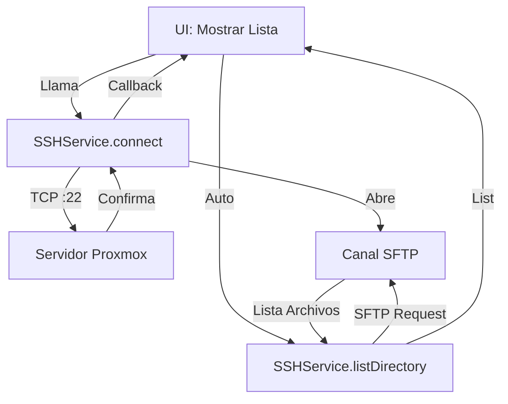

# Gestor Proxmox (Ex 05A)

## 🚀 Cómo Ejecutar la Aplicación

### En Windows
1.  Abre una terminal (PowerShell o CMD).
2.  Navega a la carpeta del proyecto:
    ```powershell
    cd 'c:\ruta\a\gestor_proxmox'
    ```
3.  Ejecuta:
    ```powershell
    flutter pub get
    flutter run -d windows
    ```

### En Ubuntu (Linux)
1.  Abre una terminal.
2.  Ejecuta:
    ```bash
    flutter config --enable-linux-desktop
    flutter pub get
    flutter run -d linux
    ```

---

## 🏗️ Estructura y Flujo del Código

### Arquitectura General
La aplicación sigue una arquitectura limpia de 3 capas simplificada para Flutter:
1.  **Modelos (`models.dart`):** Estructuras de datos puras (`ServerConfig`, `FileItem`).
2.  **Servicios (`services.dart`):** Lógica de negocio y comunicación externa (SSH, Sistema de archivos local).
3.  **UI (`main.dart`, `widgets.dart`):** Interfaz gráfica y gestión de estado visual.

### Flujo de Ejecución Detallado

1.  **Inicio y Carga (`main.dart` -> `initState`):**
    *   Al iniciarse `MainScreen`, llama a `ConfigService().loadServers()`.
    *   Esta función lee el archivo local `servers.json` (usando `path_provider` para encontrar la ruta segura en Windows/Linux) y decodifica la lista de servidores guardados.

2.  **Conexión (`SSHService.connect`):**
    *   Cuando el usuario hace clic en un servidor, se instancia `SSHClient` de la librería `dartssh2`.
    *   Se establece un socket TCP al puerto 22.
    *   Se abre una sesión SFTP (`sftpClient = await client.sftp()`) paralela para la transferencia de archivos.

3.  **Exploración de Archivos (`listDirectory`):**
    *   **Función Clave:** `SSHService.listDirectory(path)`.
    *   En lugar de parsear texto de `ls -la`, utilizamos la sesión SFTP (`_sftp!.listdir(path)`). Esto es mucho más robusto porque nos devuelve objetos con metadatos reales (tamaño, permisos, esDirectorio) sin tener que luchar con expresiones regulares sobre la salida de texto de Linux.
    *   Los resultados se mapean a nuestra clase `FileItem` y actualizan la UI.

4.  **Ejecución de Comandos (`runCommand`):**
    *   Para acciones que no son de archivos (ej. ver procesos Node), usamos `client.execute(comando)`.
    *   Esto devuelve un *Stream* de datos. Para Dart 3, usamos `.transform(const Utf8Decoder())` para convertir los bytes que llegan del servidor en texto legible (UTF-8).

### Funciones Críticas

*   `ConfigService.loadServers()`: Garantiza la persistencia de datos.
*   `SSHService.detectServer()`: Ejecuta lógica inteligente. Busca si existe `package.json` en la carpeta actual para saber si es un proyecto Node, o `.jar` para Java, y luego hace un `ps aux` grep para ver si está corriendo, devolviendo un estado completo.


