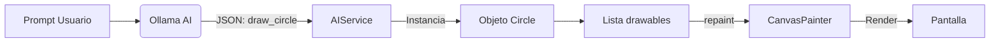

# Dibujo Vectorial IA (Ex 07A)

## 🚀 Cómo Ejecutar

### Requisitos
*   **Ollama** corriendo.

### Comandos
```powershell
flutter pub get
flutter run -d windows
```

---

## 🏗️ Estructura y Detalle Técnico

Esta app implementa un sistema de **Renderizado Declarativo** controlado por IA.

### 1. El Modelo de Datos (`canvas_painter.dart`)
A diferencia de un programa de pintura normal (donde pintas píxeles en un bitmap), aquí trabajamos con **vectores**.
*   **Clase Abstracta `Drawable`:** Es la base. Obliga a tener un método `draw(Canvas canvas, Paint paint)`.
*   **Implementaciones:** `Circle`, `Line`, `Rectangle`, `TextDrawable`. Cada una guarda sus propiedades matemáticas (centro, radio, vértices) y sabe cómo "pintarse a sí misma" usando las primitivas de Flutter (`canvas.drawCircle`, etc.).

### 2. El Pintor (`CustomPainter`)
Flutter redibuja la pantalla 60 veces por segundo (o cuando se lo pedimos).
*   La clase `CanvasPainter` recibe una **lista** `List<Drawable>`.
*   En su método `paint`:
    ```dart
    for (var drawable in drawables) {
      drawable.draw(canvas, paint);
    }
    ```
*   Esto significa que el dibujo es **persistente** y re-editable (técnicamente). Si borras la lista, se borra el dibujo.

### 3. La Inteligencia (`ai_service.dart`)
Aquí reutilizamos el patrón de **Function Calling** (ver Ex 07B), pero aplicado a la creatividad.
*   La IA tiene herramientas como `draw_circle(x, y, radius, color)`.
*   **Parseo de Argumentos:** Un punto crítico es que la IA a veces devuelve números como strings ("100"). En `_fixArgs` nos aseguramos de convertir todo a `double` para que Flutter no falle.
*   **Parseo de Colores:** La función `parseColor` es un pequeño motor de interpretación. Entiende hexadecimales (`#FF0000`) y nombres comunes (`red`, `blue`), convirtiéndolos a objetos `Color` de Flutter.

### Flujo Completo
1.  Dictas: *"Sol amarillo arriba a la derecha"*.
2.  IA calcula coordenadas (ej. x=300, y=50) y color ("yellow").
3.  IA llama `draw_circle`.
4.  App crea objeto `Circle(300, 50, yellow)`.
5.  App hace `drawables.add(circle)`.
6.  App llama `notifyListeners()`.
7.  Flutter detecta el cambio y dispara `paint()`.
8.  ¡El sol aparece!


