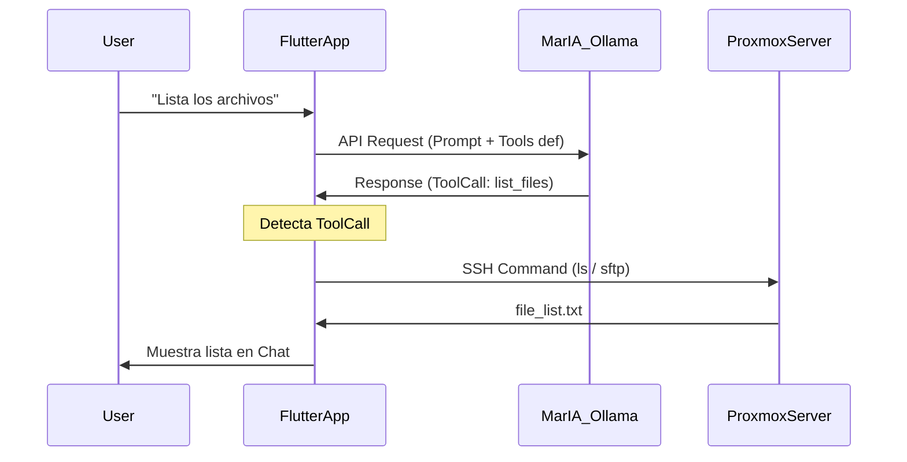

# Proxmox IA (Ex 07B)

## 🚀 Cómo Ejecutar

### Requisitos Previos
*   **Ollama** ejecutándose (MarIA).
*   URL API: `http://localhost:11414/api/chat` (túnel) o `http://192.168.1.14:11434` (directo).

### Comandos
```powershell
flutter pub get
flutter run -d windows
# o linux
```

---

## 🏗️ Estructura y Funcionamiento Interno

Esta aplicación es una evolución del **Ex 05A**, añadiendo una capa de inteligencia artificial que actúa como "copiloto".

### El Corazón: Function Calling (Uso de Herramientas)

La parte más compleja e interesante es cómo la app "integra" la IA con el código Dart. No es magia, es un **bucle de retroalimentación**.

#### Flujo paso a paso (`ai_service.dart`):

1.  **Definición (`_tools`):**
    *   Tenemos una lista `_tools` (un JSON grande) que describe *exactamente* qué puede hacer la app.
    *   Ejemplo: "Tengo una función llamada `list_files` que acepta un parámetro `path`".
    *   Esto se envía a Ollama *junto con cada mensaje del usuario*.

2.  **Solicitud (Request):**
    *   Usuario dice: *"Borra el archivo index.js"*.
    *   `AIService.sendMessage` envía a Ollama:
        *   Mensajes: `[{"role": "user", "content": "Borra el archivo index.js"}]`
        *   Tools: `[...definición de delete_file...]`

3.  **Razonamiento de la IA:**
    *   El modelo (Llama 3 / Granite) analiza el texto. Entiende que "borrar" mapea semánticamente a la herramienta `delete_file`.
    *   **IMPORTANTE:** La IA **NO** borra el archivo. La IA solo genera texto JSON: `{"name": "delete_file", "arguments": {"name": "index.js"}}`.

4.  **Intercepción y Ejecución (`_executeTool`):**
    *   La app recibe la respuesta. Detecta que no es texto normal, sino un `tool_call`.
    *   Un `switch(name)` gigante en `_executeTool` busca la función Dart correspondiente.
    *   Llama a `_ssh.deleteFile('index.js')`. Esta es la función real que conecta por SSH y borra el archivo.

5.  **Respuesta Final:**
    *   El resultado de la operación (ej. "Archivo borrado") se podría enviar de vuelta a la IA para que ella te conteste "He borrado el archivo", o (como hacemos aquí para simplificar) se muestra directamente en el chat.

### Clases Principales

*   **`AIService`**:
    *   Gestiona la configuración HTTP (`http.post`).
    *   Mantiene el esquema JSON de las tools.
    *   Actúa de traductor: Lenguaje Natural <-> Llamadas a Funciones Dart.
*   **`SSHService`** (Heredado de Ex 05A):
    *   Ejecuta las órdenes "físicas" reales. La IA no sabe de SSH, solo sabe de "intenciones". `SSHService` sabe de paquetes TCP y protocolos.


